# Galagino 3.2A a special LVL ESP32-2432S024 / ESP32-024 porting with enanched joystick and flyer oled display, with bluethooth support for external controller. 
# Now with 48 games !!!

Also updated to support ESP32-024 CYD clone modules, see info below.

Galagino V3.2A software can be uploaded on V2.0 hardware without any modification.

Video tutorial for build a new Galagino V3.0:  https://youtu.be/Nz3LRrY3Ukw 

To build a joystick follow Galagino V2.0 video: https://youtu.be/YmvyNwJLqJM

ported from Survival hacking version of Galagino 3.2 with 23 games.
ported from speckholier platformio to Arduino IDE - with 8 additional games: https://github.com/speckhoiler/galagino
This repo is a port of Till Harbaum's awesome [Galaga emulator](https://github.com/harbaum/galagino) ported to platformio.
This port is NOT by the original author, so please do not bother him with issues.

## Hardware

* Joystick 4 posizioni/4 way joystick type15: https://s.click.aliexpress.com/e/_c3Qgeoth
* PCF8574P: https://s.click.aliexpress.com/e/_oDPPZgo
* Module LVGL 2.4" ESP32-2432S024: https://s.click.aliexpress.com/e/_DECY96V 
WARNING, LVGL module can be shipped as the clone version ESP32-024 that need a different wirings and code, see below

* Connettori JST 1.25MM, 10Cm, 2P/Connector 2P: https://s.click.aliexpress.com/e/_DBzkKsz
* Connettori JST 1.25MM, 10Cm, 4P/Connector 4P: https://s.click.aliexpress.com/e/_DF72N8Z
* Batteria al Litio 3.7V 2000mA/lythium battery: https://s.click.aliexpress.com/e/_c3S7Fg07 oppure https://amzn.to/4b0yBZs
* Altoparlante 3070/Speaker: https://s.click.aliexpress.com/e/_c4NQslWX oppure https://amzn.to/48bumpJ
* Display OLED SD1306 0.91" : https://s.click.aliexpress.com/e/_c4DUrL47 
* Pulsanti 6x6x10 type 4 /PushButton: https://s.click.aliexpress.com/e/_c4eKUiJH
* Resistenze SMD 4.7K 0805/Resistors: https://s.click.aliexpress.com/e/_DdHzrWd
* USB-C da pannello 6P 5A/USB panel mount 6P 5A: https://s.click.aliexpress.com/e/_c3BmvvEj
* Mini controller BT: https://s.click.aliexpress.com/e/_c2JYkcQF

---

UPDATE !!!!
Recently, some modules have been shipped that are clones of those used in the project and have a different display driver as well as different connections on the connectors.
If your module is one of these (ESP32-024)—and you’ll notice right away because when you upload the code, the screen will be rotated 90°—then you must use the latest version of the code, 3.2A, and follow the new wiring diagram 3.0A. You’ll also need to modify the definition for your display type in the config.h file.

Comment out the line:     // #define CHEAP_YELLOW_DISPLAY_CONF

And uncomment the line:   #define CHEAP_YELLOW_DISPLAY_CONF_ALT  

---

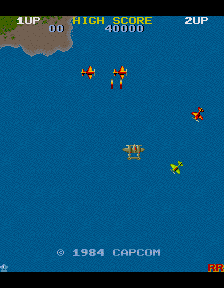
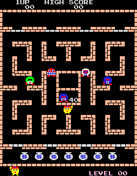
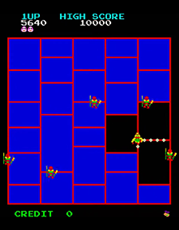
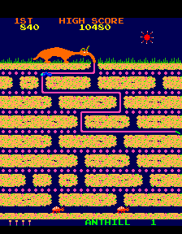
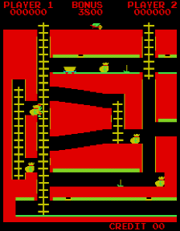
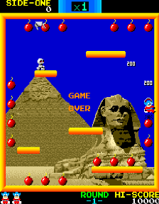
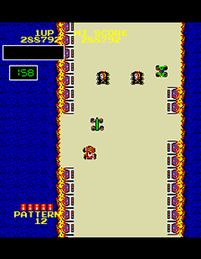
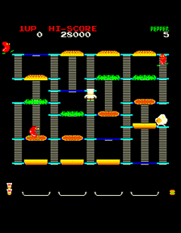
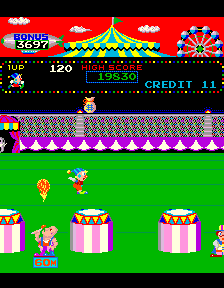
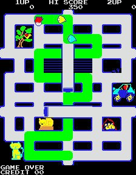
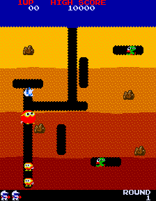
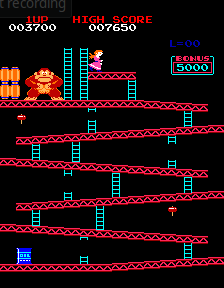
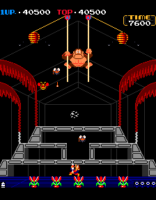
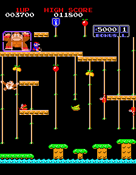
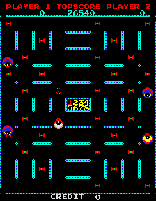
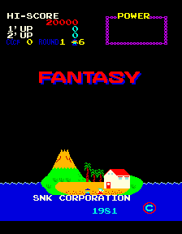
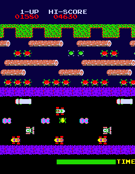

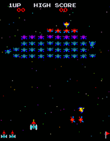
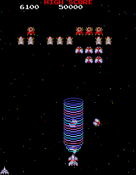
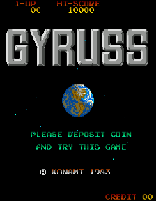
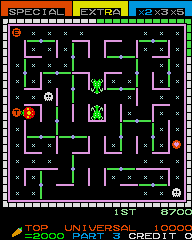
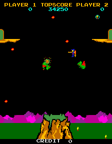
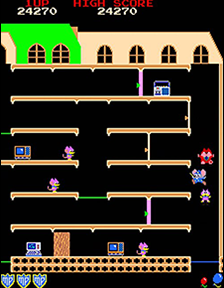
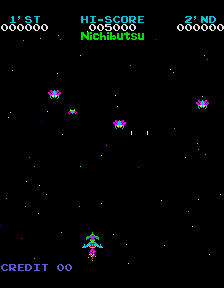
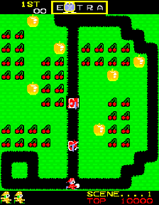
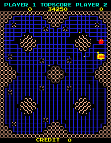
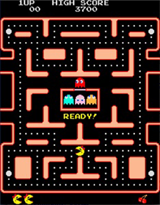
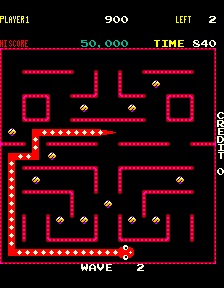
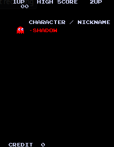
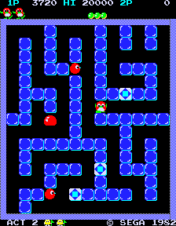
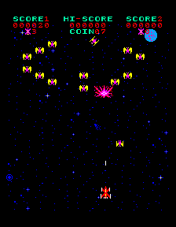
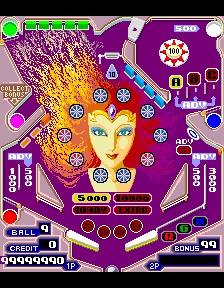
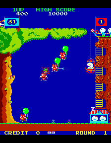
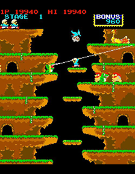
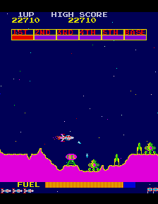
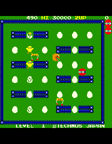
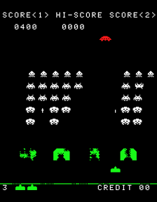
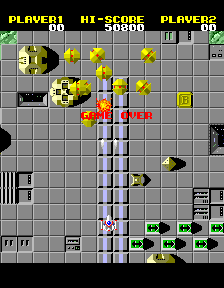
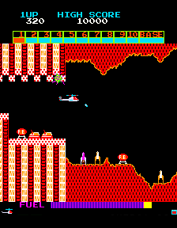
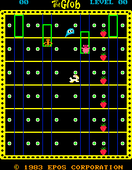
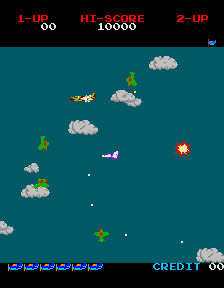
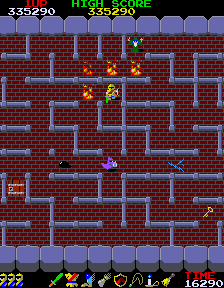
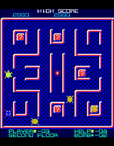
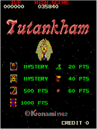
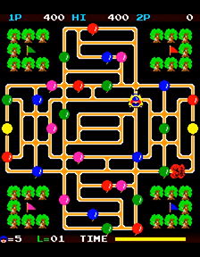
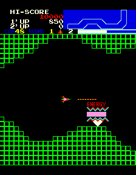
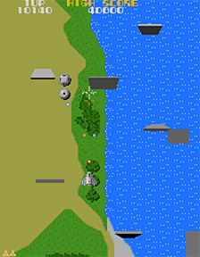

## Software

Like in the original from Till Harbaum's Galaga emulator, download these files:

* The [Galagino specific code](source/) contained in this repository
* A [Z80 software emulation](https://fms.komkon.org/EMUL8/Z80-081707.zip) by [Marat Fayzullin](https://fms.komkon.org/)
* The original ROM files
    * [1942](https://www.google.com/search?q=1942.zip+arcade+rom)
    * [Ali Baba and 40 Thieves](https://www.google.com/search?q=alibaba.zip+arcade+rom)
    * [Amidar](https://www.google.com/search?q=amidar.zip+arcade+rom)
    * [Anteater](https://www.google.com/search?q=anteater.zip+arcade+rom)
    * [Bagman](https://www.google.com/search?q="bagmanm2.zip"+download) (Important: filename with "m2")
    * [Bombjack](https://www.google.com/search?q=bombjack.zip+arcade+rom)
    * [Bump 'n' jump](https://www.google.com/search?q=bnj.zip+arcade+rom)
    * [Burger time](https://www.google.com/search?q=btime.zip+arcade+rom)
    * [Circus Charlie](https://www.google.com/search?q=circusc.zip+arcade+rom)
    * [Crush Roller](https://www.google.com/search?q=crush.zip+arcade+rom)
    * [Digdug](https://www.google.com/search?q=digdug.zip+arcade+rom)
    * [Donkey Kong (US set 1)](https://www.google.com/search?q=dkong.zip+arcade+rom)
    * [Donkey Kong 3](https://www.google.com/search?q=dkong3.zip+arcade+rom)
    * [Donkey Kong Jr. (Japan)](https://www.google.com/search?q=dkongjrj.zip+arcade+rom) (Important: filename with "jrj")
    * [Eyes](https://www.google.com/search?q=eyes.zip+arcade+rom)
    * [Fantasy](https://www.google.com/search?q=fantasy.zip+arcade+rom)
    * [Frogger](https://www.google.com/search?q=frogger.zip+arcade+rom)
    * [Galaga (Namco Rev. B ROM)](https://www.google.com/search?q=galaga.zip+arcade+rom)
    * [Galaxian](https://www.google.com/search?q=galaxian.zip+arcade+rom)
    * [Gaplus](https://www.google.com/search?q=gaplus.zip+arcade+rom)
    * [Gyruss](https://www.google.com/search?q=gyruss.zip+arcade+rom)
    * [Lady Bug](https://www.google.com/search?q=ladybug.zip+arcade+rom)
    * [Lizard Wizard](https://www.google.com/search?q=lizwiz.zip+arcade+rom)
    * [Mappy](https://www.google.com/search?q=mappy.zip+arcade+rom)
    * [Moon Cresta](https://www.google.com/search?q=mooncrst.zip+arcade+rom)
    * [Mr. Do!](https://www.google.com/search?q=mrdo.zip+arcade+rom)
    * [Mr. TNT](https://www.google.com/search?q=mrtnt.zip+arcade+rom)
    * [Ms. Pacman](https://www.google.com/search?q=mspacman.zip+arcade+rom)
    * [Nibbler](https://www.google.com/search?q=nibbler.zip+arcade+rom)
    * [Pac-Man (Midway)](https://www.google.com/search?q=pacman.zip+arcade+rom)
    * [Pengo](https://www.google.com/search?q=pengo.zip+arcade+rom) 
    * [Phoenix](https://www.google.com/search?q=phoenix.zip+arcade+rom)
    * [Pinball Action](https://www.google.com/search?q=pbaction.zip+arcade+rom)
    * [Pooyan](https://www.google.com/search?q=pooyan.zip+arcade+rom)
    * [Roc'n Rope](https://www.google.com/search?q=rocnrope.zip+arcade+rom)
    * [Scramble](https://www.google.com/search?q=scramble.zip+arcade+rom)
    * [Scrambled egg](https://www.google.com/search?q=scregg.zip+arcade+rom)
    * [Space Invaders](https://www.google.com/search?q=invaders.zip+arcade+rom)
    * [Starforce](https://www.google.com/search?q=starforc.zip+arcade+rom)
    * [Super Cobra](https://www.google.com/search?q=scobra.zip+arcade+rom)
    * [The Glob](https://www.google.com/search?q=theglobp.zip+arcade+rom) (Important: filename with "p")
    * [Time Pilot](https://www.google.com/search?q=timeplt.zip+arcade+rom)
    * [Tower of Druaga](https://www.google.com/search?q=todruaga.zip+arcade+rom)
    * [Turtles](https://www.google.com/search?q=turtles.zip+arcade+rom)
    * [Tutankham](https://www.google.com/search?q=tutankhm.zip+arcade+rom)
    * [Van Van Car](https://www.google.com/search?q=vanvan.zip+arcade+rom)
    * [Vanguard](https://www.google.com/search?q=vanguard.zip+arcade+rom)
    * [Xevious](https://www.google.com/search?q=xevious.zip+arcade+rom)
      
Due to memory limitations, not all games can be enabled. Edit the config.h file to select which games to enable. At least two must always be disabled; otherwise, they won’t fit in the ESP32’s memory.
By default, only new games are enabled; some of the game are still emulated but run too slowly to be playable.

Galagino uses code that is not freely available and thus not included in this repository. Preparing the firmware thus consists of a few additional steps:

* If you do not have Python installed, download it from here. [Python 3.13.0](https://www.python.org/downloads/release/python-3130)
* The ROM ZIP files have to be placed in the [romszip directory](romszip/), together with the ZIP file containing the Z80 emulator.
* A set of [python scripts](romconv/) is then being used to convert and patch the ROM data and emulator code and to include the resulting code into the galagino machines directory. For all games, just use conv__all.bat.

The [ROM conversion](./romconv) create a whole bunch of additional files in the [source directory](./source). Please check the README in the [romconv](./romconv) directory for further instructions.
Please ensure that the stripts run without errors!

* Open src.INO with Arduino IDE
* Add this url in your arduino ide board source preferences: https://raw.githubusercontent.com/ricardoquesada/esp32-arduino-lib-builder/master/bluepad32_files/package_esp32_bluepad32_index.json 
* then add a ESP32 bluepad board
* select board "ESP 32 DEV module" family:esp32_bluepad32
* Use huge partition
* Enable PSRAM

## Controls

* Joystick UP/DOWN to select game
* Any key to enter in the selected game.
* COIN key to add coins
* START key to start game or flight loop in 1945 game
* FIRE key to of a fire in game the uses fire/action
* COIN + UP/DOWN to setup volume
* COIN pressed for 10 second to enable/disable BT
* START for 5 seconds to exit game and return to selection menu
* FIRE during boot to access configuration menu

## Attract mode

In Attract mode, the machine cycles through all games if you do not touch the joystick. The games end after 5 minutes.

## Revisions
V3.0 1/2/2026  
 * Conversion from speckhoiler VsCode version to Arduino Ide by Paolo Sambinello
 * Adding a Bluethoot Controller support, by Paolo Sambinello
 * Adding a Bluethooot enabler/disabler and increase lives to 5 by Marco Prunca
 * Adding a COIN animation by Marco Prunca
 
V3.1 11/3/2026
 * Added Lady Bug by Paolo Sambinello and Davide Gatti 
 * Added Gyruss by Paolo Sambinello and Marco Prunca (Playable but with reducete audio features AY3-8910 #3 emulated instead of #5)
 * Added MsPacman by Marco Prunca (work 100%)
 * Added Pengo by Spek Hoiler and Paolo Sambinello and Marco Prunca
 * Added Time Pilot by Marco Prunca
 * Added Bagman By SpeckHoiler
 * Added SpaceInvaders by Marco Prunca
 * Detect automaticallu PCF8574 / PCF8574A
 * Added Name list at boot
 * Fixed conditional compile to allow remove/add games without problems
 
V3.2 26/4/2026 
 * Added QR code by Paolo Sambinello
 * Added Configuration Menu by Paolo Sambinello
 * Fixed insert coin animation by Marco Prunca
 * Added Galaxian game by Marco Prunca (minor audio problems)
 * Fixed Time Pilot game by Marco Prunca (minor glitch on clouds graphichs)
 * Added Tutankham game by Marco Prunca (not playable at full speed)

V3.2A 21/06/2026
 * Added support for alternate Cheap Yellow Display ESP32-024, need to move Joystick Connector to upper right connector integrating +3v3 wire. See new schematic 3.0A

v3.2A 48 GAMES EDITION 30/09/2026
* Added Phoenix by Marco Prunca
* Added Moon Cresta, Scramble and Super Cobra by [Galagino](https://github.com/galagino/galagino)
* Added Pinball Action from [BaasPierre](https://github.com/BaasPierre)
* Added Starforce, Donkey Kong jr and Donkey Kong 3 from [Alby1970](https://github.com/Alby1970)
* Graphical bugs have been fixed in Mr. Do!
* Added Pengo original version (replaces the previous version) with the original "PopCorn" music and the creation of the labyrinth at the beginning of each level by VirtualClaudioBoy.
* Added Ali Baba and 40 Thieves, Amidar, Bump 'n' jump, Burger time, Circus Charlie, Fantasy, Gaplus, Mappy, Nibbler, Pooyan, Roc'n rope, Scrambled egg, Tower of Druaga, 
Turtles, Van Van Car, Vanguard and Xevious by VirtualClaudioBoy

